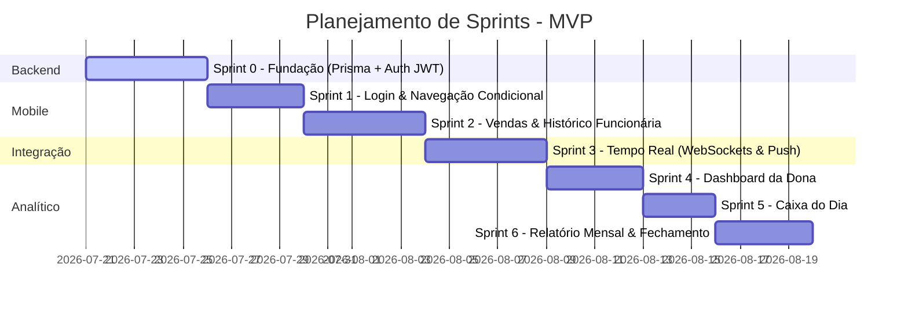

# Adorne ERP/CRM — Do Caderno de Papel ao Tempo Real 💍📱

> **Uma solução real para dores reais.** Como transformamos a gestão manual da loja *Semijoias Adorne* em um ecossistema mobile reativo, robusto e preparado para virar SaaS.

---

## 📖 A História por Trás do Projeto

### O Cenário
Imagine uma loja física de semijoias fina e elegante, com clientes exigentes e peças exclusivas. No entanto, por trás das vitrines brilhantes, a operação diária dependia de um velho conhecido de muitos pequenos negócios: **o caderno de papel**. 
Todas as vendas eram anotadas manualmente. O estoque era conferido visualmente e a comunicação de fechamento de caixa dependia de mensagens de WhatsApp ao fim do dia.

### As Dores
1. **Para a Dona da Loja:** "Quanto vendemos hoje?" dependia de enviar uma mensagem para a funcionária e aguardar a resposta. Sem dados consolidados de faturamento, ticket médio ou desempenho em tempo real.
2. **Para a Funcionária:** Registrar vendas de forma rápida sem travar o atendimento presencial era um desafio.
3. **Para o Negócio:** Dados dispersos, falta de histórico confiável de clientes e nenhuma inteligência comercial sobre sazonalidades ou estoque.

### O Nascimento do Adorne ERP/CRM
Para resolver este abismo de visibilidade, idealizamos este **mini ERP/CRM Mobile**. O app atua com dois perfis integrados que se comunicam instantaneamente:
- A **Funcionária** registra a venda no balcão da loja física em menos de 10 segundos.
- A **Dona** recebe uma notificação push no celular imediatamente e vê o gráfico de faturamento e ticket médio do dia se atualizando no dashboard sem precisar de nenhum refresh.

---

## 🛠️ Decisões de Arquitetura que Importam (Foco do Recrutador 🚀)

Para desenvolver um software de nível profissional, nos preocupamos com a escalabilidade, resiliência e segurança desde a primeira linha de código:

### 1. Multi-Tenant por Design (Preparado para SaaS)
Embora o MVP atenda apenas à *Semijoias Adorne*, o banco de dados e as queries da API foram estruturados com isolamento de dados por `lojaId` e `filialId` desde o início. Isso significa que podemos transformar o app em um SaaS multi-empresa no futuro sem precisar reescrever a arquitetura.

### 2. Sincronização em Tempo Real Reativa
Utilizamos **WebSockets (Socket.io)** para conectar as ações da funcionária ao painel de controle da dona. Se o app da dona estiver fechado, a API NestJS despacha uma **Notificação Push** via Expo. E se a dona estiver ativa no app, o dashboard atualiza dinamicamente.

### 3. Resiliência a Falhas de Conexão (Fila Local)
Conexões móveis oscilam. Por isso, projetamos o aplicativo mobile com uma **fila local de sincronização**. Se a funcionária registrar uma venda em um momento de instabilidade, a venda é armazenada localmente e transmitida à API assim que o sinal de internet retornar.

### 4. Segurança e Controle de Acesso (RBAC)
Com autenticação **JWT**, as credenciais decodificadas no token definem não apenas a interface mobile do usuário (`DonaStack` vs `FuncionariaStack`), mas também as permissões a nível de backend utilizando **NestJS Guards** para impedir que funcionários visualizem dados consolidados de faturamento.

---

## 🧳 A Stack Técnica

### **Backend (Core API)**
- **NestJS**: Framework modular Node.js com TypeScript voltado para escalabilidade.
- **Prisma ORM**: Modelagem de dados fluida com migrações automatizadas.
- **PostgreSQL**: Banco relacional robusto para consistência de dados financeiros.
- **Socket.io**: Comunicação bidirecional e eventos orientados em tempo real.

### **Frontend & Mobile**
- **React Native + Expo**: Desenvolvimento nativo multiplataforma moderno.
- **NativeWind (Tailwind CSS)**: Estilização utilitária rápida e consistente.
- **TanStack Query (React Query)**: Cache de dados, sincronização inteligente e fallback por polling.
- **Expo Notifications**: Gerenciamento integrado de notificações push nativas.

---

## 🗺️ O Mapa de Desenvolvimento (Sprints)

O projeto está estruturado em entregáveis incrementais baseados no MVP:



---

## ⚙️ Como Executar o Projeto (Pós-Sprint 0)

### Requisitos Mínimos
- Node.js (v18+)
- Docker e Docker Compose
- Expo Go instalado no smartphone (para testar o mobile)

### Passo a Passo

1. **Clonar os repositórios:**
   ```bash
   git clone https://github.com/seu-usuario/erp-semijoias-api.git
   git clone https://github.com/seu-usuario/erp-semijoias-app.git
   ```

2. **Configurar e iniciar o Backend:**
   ```bash
   cd erp-semijoias-api
   npm install
   # Sobe o banco PostgreSQL via Docker
   docker compose up -d
   # Executa migrations e insere os dados de teste (Seed)
   npx prisma migrate dev
   npm run seed
   # Inicia a API local em modo de desenvolvimento
   npm run start:dev
   ```

3. **Configurar e iniciar o Mobile:**
   ```bash
   cd ../erp-semijoias-app
   npm install
   # Inicia o servidor Expo Metro Bundler
   npx expo start
   ```

---

## 👥 Autor

- **Jonas Ferreira Silva** - *Idealizador & Desenvolvedor Full Stack*
- Contato / LinkedIn: [Adicione seu link de preferência]
