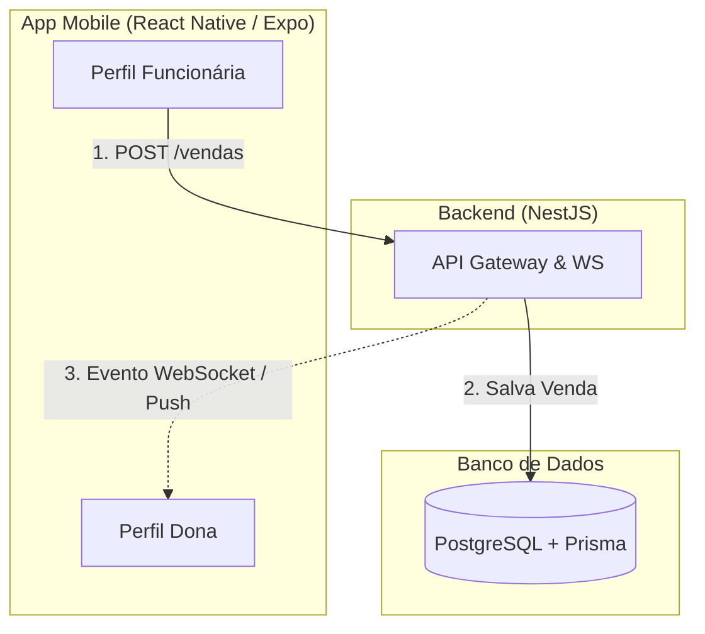
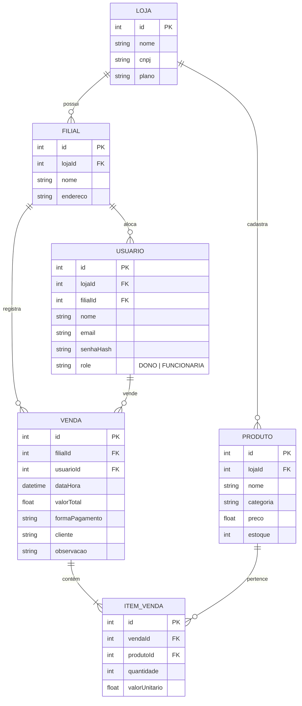

# Documentação do Projeto — ERP/CRM Mobile Semijoias Adorne

**Versão:** 1.0 | **Status:** MVP em planejamento | **Autor:** Jonas Ferreira Silva

---

## 1. Visão Geral

### 1.1 O que é o projeto
Um aplicativo mobile de gestão de vendas (mini ERP/CRM) voltado inicialmente para a loja **Semijoias Adorne**, com dois perfis de acesso que se comunicam em tempo real:
- **Funcionária**: Registra vendas no dia a dia, na loja física.
- **Dona da loja**: Acompanha vendas, caixa, desempenho e relatórios de qualquer lugar, em tempo real.

Este projeto é separado do e-commerce (vitrine online) já em desenvolvimento para a mesma marca. O e-commerce atende clientes finais na internet; este ERP atende a gestão interna da operação física (matriz e filial).

### 1.2 Problema que resolve
Lojas pequenas de semijoias, roupas e acessórios costumam controlar vendas por caderno, WhatsApp ou planilha, sem visibilidade em tempo real, sem histórico organizado e sem inteligência sobre o próprio negócio. O app resolve isso trazendo:
- Registro de venda simples e rápido pela funcionária.
- Visibilidade instantânea para a dona, sem precisar perguntar "quanto vendeu hoje?".
- Base de dados histórica que, no futuro, permite gerar insights (sazonalidade, desempenho por filial, etc.).

### 1.3 Visão de produto (longo prazo)
Ainda que o MVP seja feito sob medida para a Semijoias Adorne, o modelo de dados e a arquitetura devem ser desenhados desde o início para suportar multiempresa (multi-tenant), permitindo no futuro oferecer o sistema como SaaS para outras lojas de pequeno porte. Isso não significa implementar recursos de SaaS agora — significa não tomar decisões de modelagem que impeçam essa evolução depois.

---

## 2. Personas

### 2.1 Funcionária
- Acessa o app apenas com o essencial: registrar venda, ver histórico próprio, ver meta do dia e ver caixa do dia.
- Não vê dados financeiros consolidados da loja, nem dados de outras funcionárias.

### 2.2 Dona da loja
- Acesso total: dashboard consolidado, todas as vendas, todas as filiais, todos os funcionários, relatórios, clientes e estoque.
- Recebe notificações em tempo real de cada nova venda registrada.

---

## 3. Escopo do MVP

O MVP tem um objetivo único: validar, no uso real do dia a dia da loja, que o app substitui com sucesso o controle manual de vendas, antes de investir em recursos avançados.

### Incluído no MVP
1. **Login com dois perfis** (dono/funcionária), com autenticação JWT.
2. **Cadastro de produtos** (nome, categoria, preço, estoque inicial).
3. **Registro de venda** (produto, quantidade, valor, forma de pagamento, cliente opcional, observação).
4. **Sincronização em tempo real** entre o app da funcionária e o app da dona.
5. **Dashboard básico da dona** (vendas do dia, quantidade de peças, ticket médio, breakdown por forma de pagamento).
6. **Caixa do dia** (conferência de valores recebidos por forma de pagamento).
7. **Relatório mensal simples** + comparação com o mês anterior.
8. **Suporte a matriz + filial** desde o início do modelo de dados (mesmo que a UI de comparação entre filiais venha depois).

### Fora do MVP (roadmap futuro, pós-validação)
- Controle de estoque automático completo (baixa automática, alertas de reposição).
- Cadastro e histórico detalhado de clientes (CRM completo).
- Metas configuráveis e acompanhamento de progresso.
- Inteligência de vendas (previsões, sazonalidade, comparação de desempenho entre filiais).
- Multiempresa (SaaS) com cadastro de novas lojas, planos e cobrança recorrente.

---

## 4. Arquitetura e Stack Técnica

### 4.1 Visão geral da arquitetura

Um único código-base de app mobile, com telas e navegação condicionadas à `role` (função) do usuário autenticado (não são dois apps separados).

A comunicação em tempo real é feita via WebSocket para o evento de nova venda registrada e notificações push para quando o app da dona estiver em background.



### 4.2 Stack

*   **Mobile**
    *   React Native + Expo
    *   NativeWind (estilização)
    *   React Navigation
    *   TanStack Query (cache e sincronização de dados assíncronos)
    *   Expo Notifications (push notifications)
    *   Socket.io-client (tempo real)
*   **Backend**
    *   NestJS
    *   Prisma ORM
    *   PostgreSQL
    *   Socket.io (gateway WebSocket)
    *   JWT para autenticação, com guards por `role`
*   **Hospedagem (MVP)**
    *   API: Railway, Render ou VPS
    *   Banco: PostgreSQL gerenciado (mesmo provedor ou Neon/Supabase)

---

## 5. Modelo de Dados (entidades principais)

Estrutura pensada para já suportar múltiplas lojas e múltiplas filiais por loja, mesmo que o MVP opere com uma única loja (Semijoias Adorne).



### Entidades Detalhadas
- **Loja**: Representa o tenant (mesmo havendo só uma no MVP). Campos: `nome`, `CNPJ` (opcional no MVP), `plano` (não usado ainda).
- **Filial**: Pertence a uma Loja. Campos: `nome` (ex: "Matriz", "Filial 1"), `endereço` (opcional).
- **Usuario**: Pertence a uma Loja e a uma Filial. Campos: `nome`, `e-mail/login`, `senha` (hash), `role` (`DONO` | `FUNCIONARIA`).
- **Produto**: Pertence a uma Loja. Campos: `nome`, `categoria`, `preço`, `estoque` (campo presente desde o MVP, mesmo que a baixa automática venha depois).
- **Venda**: Pertence a uma Filial e a um Usuario (quem vendeu). Campos: `data/hora`, `valor total`, `forma de pagamento`, `cliente` (texto livre no MVP, sem cadastro completo), `observação`.
- **ItemVenda**: Pertence a uma Venda. Campos: `produto`, `quantidade`, `valor unitário`.

**Relações-chave:**
- Uma Loja tem várias Filiais.
- Uma Filial tem vários Usuários e recebe várias Vendas.
- Uma Venda tem vários ItensVenda.

---

## 6. Autenticação e Permissões

- **Login único**: Feito por e-mail/senha, retornando um JWT com `userId`, `role`, `lojaId` e `filialId`.
- **Backend Guards**: Bloqueiam endpoints de dados consolidados (dashboard, relatórios) para usuários com `role = FUNCIONARIA`.
- **Mobile Routing**: No mobile, a navegação (stack de telas) é escolhida logo após o login, com base no `role` retornado.

---

## 7. Sincronização em Tempo Real

```mermaid
sequenceDiagram
    autonumber
    actor F as Funcionária (App)
    participant API as API NestJS
    database DB as PostgreSQL
    actor D as Dona (App)
    participant Expo as Expo Push Service

    F->>API: POST /vendas (Registrar Venda)
    API->>DB: Salvar Venda e Itens no Banco
    DB-->>API: Confirmação de persistência
    API-->>F: HTTP 201 Created (Sucesso)
    
    rect rgb(30, 41, 59)
        note right of API: Fluxo de Tempo Real / Notificação
        alt Dona está online (WebSocket conectado)
            API->>D: WebSocket Event (venda.criada)
            Note over D: Atualiza Dashboard em tempo real (sem refresh)
        else Dona está offline (App em background/fechado)
            API->>Expo: Dispara Push Notification request
            Expo->>D: Envia Push Notification "Nova Venda Registrada!"
        end
    end
```

### Detalhes do Fluxo:
1. **Registro da Venda**: Funcionária registra uma venda → `POST` para a API.
2. **Salvamento e Evento**: A API salva no banco e emite um evento WebSocket (`venda.criada`) na sala da Filial/Loja correspondente.
3. **Atualização Instantânea**: O app da dona, conectado ao WebSocket, recebe o evento e atualiza o dashboard instantaneamente.
4. **Fallback Push**: Se o app da dona estiver em background/fechado, a API também dispara uma push notification via Expo.
5. **Rede de Segurança**: Caso a conexão WebSocket caia, o TanStack Query deve fazer refetch periódico (polling leve, ex: a cada 30-60s) como rede de segurança.

---

## 8. Plano de Sprints (MVP)

| Sprint | Entregável | Descrição Detalhada |
| :---: | :--- | :--- |
| **0** | **Fundação (Backend + Infra)** | Setup do backend (NestJS + Prisma + PostgreSQL via Docker), modelagem inicial do banco, autenticação JWT com os dois perfis. |
| **1** | **Login e Navegação Mobile** | Login mobile + navegação condicional por `role`. |
| **2** | **Registro de Venda** | Registro de venda (funcionária) + histórico de vendas próprio. |
| **3** | **Sincronização em Tempo Real** | Sincronização em tempo real (WebSocket) + push notification para a dona. Fila local de vendas offline. |
| **4** | **Dashboard da Dona** | Dashboard da dona (vendas do dia, ticket médio, breakdown por forma de pagamento). |
| **5** | **Caixa do Dia** | Caixa do dia (conferência por forma de pagamento) para funcionária e dona. |
| **6** | **Relatório Mensal** | Relatório mensal + comparação com o mês anterior. |

> [!IMPORTANT]
> **Critério de saída do MVP:** A funcionária e a dona conseguem usar o app no dia a dia real da loja, substituindo o controle manual, por pelo menos algumas semanas, sem necessidade de voltar ao caderno/planilha.

---

## 9. Roadmap Pós-MVP (não implementar agora)

1. **Estoque automático**: Baixa automática por venda, alertas de reposição.
2. **CRM Completo**: Cadastro completo de clientes + histórico de compras + campanhas segmentadas.
3. **Metas**: Metas configuráveis por período, com acompanhamento visual de progresso.
4. **Comparativos**: Comparação de desempenho entre filiais e entre funcionárias.
5. **Inteligência de Vendas**: Identificação de padrões sazonais, previsão de fechamento do mês.
6. **Multiempresa (SaaS)**: Onboarding self-service de novas lojas, planos e cobrança recorrente.

---

## 10. Riscos e Pontos de Atenção

*   > [!WARNING]
    > **Evitar Scope Creep:** O maior risco deste projeto é a tentação de implementar estoque, clientes, metas ou inteligência antes de validar o básico. O MVP definido na Seção 3 deve ser respeitado rigorosamente até a validação real de uso.
*   > [!TIP]
    > **Tratamento de Quedas de Conexão:** Testar exaustivamente cenários de perda de conexão (funcionária sem internet no momento da venda). É recomendada a implementação de uma fila local no app para reenviar as vendas automaticamente assim que a conexão for restabelecida.
*   > [!IMPORTANT]
    > **Multi-tenant desde o Início:** Mesmo com uma única loja no MVP, todo endpoint e query do backend devem sempre filtrar por `lojaId`. Isso evita um grande retrabalho de segurança e arquitetura ao abrir o sistema para outras lojas (SaaS) no futuro.